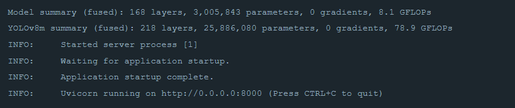
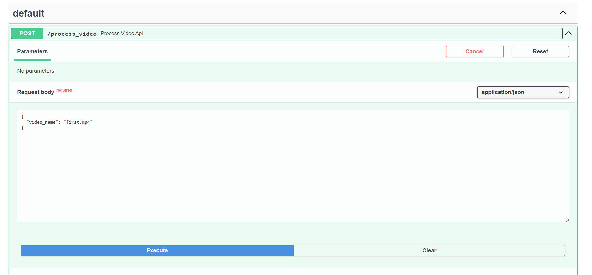
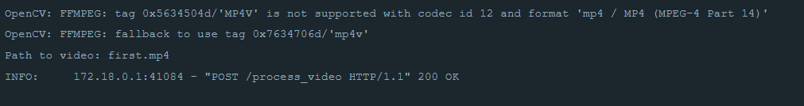

# Computer Vision Project

## Авторы
1. **Алимов Исмаил (209)**
2. **Лысаковская Екатерина (214)**

---

## О проекте

### Цель:
Изучить и применить методы компьютерного зрения для решения прикладных задач, связанных с обработкой видео и распознаванием объектов.

### Задачи:
Разработка алгоритма, способного автоматически выделять транспортные средства и распознавать их регистрационные номера на видео.
Создание системы для обработки, анализа и сохранения информации о транспортных средствах в удобном формате.
Обеспечение визуализации результатов, включая создание видео с отмеченными объектами и сохранение данных для последующего анализа.
- Оптическое распознавание символов (OCR).
- Трекинг объектов на видео.

### Объекты:
Транспортные средства: распознаются и выделяются с использованием предварительно обученной нейросети.
Регистрационные номера: идентифицируются как сегменты изображения, которые затем проходят преобразование и распознавание текста.

### Применение:
На вход подаётся видео, записанное с видеорегистратора или дорожной камеры. Алгоритм выполняет следующие действия:

Детекция автомобилей: С использованием предобученной модели YOLO автомобили выделяются в каждом кадре.
Детекция номеров: Вторая модель находит регистрационные номера на транспортных средствах.
### Обработка номеров:
Сегменты с номерами сохраняются как изображения.
Номера преобразуются в черно-белый формат для улучшения качества распознавания текста.
Номера считывается с помощью библиотеки EasyOCR.
Извлечённый текст сохраняется как изображение и записывается в формате CSV.
### Визуализация результатов:
На видео отображаются рамки вокруг автомобилей и номеров.
Если номер распознан, его изображение добавляется на видеокадр.

### Входные данные:
Видео в формате .mp4.
### Выходные данные:
В папке results/*имя_видео* создаются следующие файлы и каталоги:

**`orig`**: изображения оригинальных сегментов с номерами.

**`bin`**: черно-белые версии тех же сегментов.

**`txt`**: изображения с визуализацией распознанного текста.

**`CSV-файл`**: содержит информацию о каждом автомобиле, включая координаты рамки, уверенность детекции, текст номера и его уверенность.
**`Видео`**: файл с выделенными рамками и отображением распознанных номеров.

## Инструкция по запуску в Docker

### Шаги:
1. Клонируйте репозиторий
2. Постройте и запустите контейнер:
``` docker-compose up --build ```
3. Дождитесь завершения билда и развёртывания. Когда контейнер полностью запустится, в логах появится сообщение:


4. Откройте в браузере Swagger UI - http://localhost:8000/docs
5. Подготовьте входное видео:
    - Поместите видео в папку проекта ```videos``` (например, ```videos/first.mp4```).
6. Запустите обработку:
    - В Swagger выберите метод process_video.
    - Нажмите Try it out, укажите имя видеофайла, например:
    ```json
    {
    "video_name": "first.mp4"
    }
    ```
    
    - Нажмите Execute. Начнётся загрузка и обработка видео.
7. Мониторинг:
    - Обработка видео может занять некоторое время. Вы можете следить за появлением первых результатов в папке ```results/*имя видео*/orig```.
8. После завершения обработки будет отправлен HTTP-ответ с кодом 200. Можно повторить шаги для следующего видео.


## Пример результата:
[results/test_with_gpu/out_test.mp4](results/test_with_gpu/out_test.mp4)
## Особенности
Автоматизация распознавания номеров машин.
Простота интеграции с другими системами для анализа данных о транспортных средствах.
Удобный интерфейс для визуализации результатов.

## Перспективы развития:

Улучшение точности распознавания текстов на сложных кадрах.
Добавление поддержки других форматов видео и номеров из разных стран.
Расширение функционала, например, подсчёт автомобилей или классификация типов транспортных средств.
